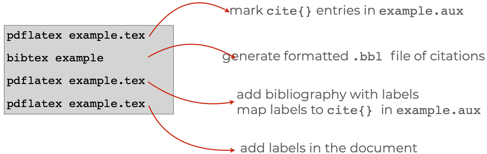
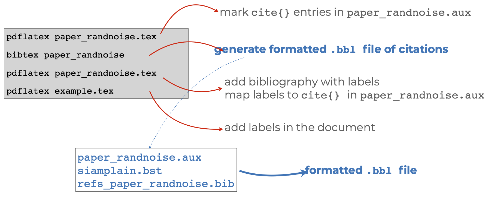
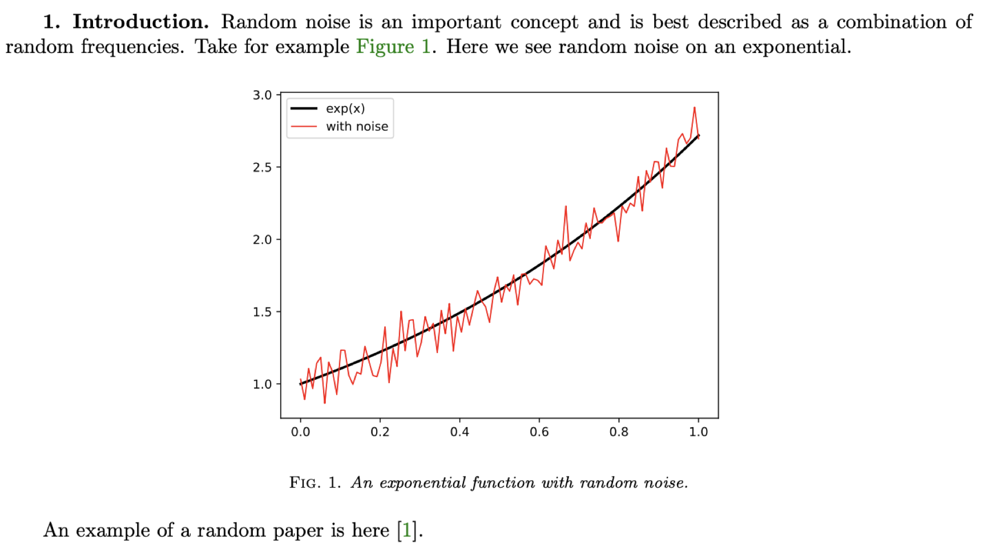

This guide shows you how to write a scientific article using the [LaTeX](https://en.wikipedia.org/wiki/LaTeX) document
preparation and markup system. We emphasize typing commands at the [unix command
line](https://en.wikipedia.org/wiki/Unix_shell) in this guide as a way for reader to see what is happening under the hood of
the LaTeX engine and thus gain flexibility and power over the production of their own academic documents. We provide some links to graphical interfaces to LaTeX at the
end of the document.

To help people **practice** these commands we have a [Jupyter Lab](TODO) instance
available within which you can start a Terminal session so that you can type
the commands required to build a publication quality pdf from a LaTeX file. You
can start this environment [here](TODO). 

# The structure of a document

A LaTeX document (or a `.tex` file) is a [plain text](https://en.wikipedia.org/wiki/Plain_text) document that contains
commands to the LaTeX processing programs that instruct it how to create a
beautiful pdf. This figure shows a whole LaTeX document  explains at a high level what the parts of
the document do.


## Practice:

Look at the directory `1_structure` in the [associated github repository](http://) (You can
practice typing these commands in the command line by clicking on the `launch
binder` button on that repository, and then clicking on the `Terminal` icon in
the Jupyter Lab pane.)

You can also copy the github repository to your own local machine and launch the Terminal to see a Unix command prompt if you are using a Mac or Linux machine. Windows machine also offer a unix command prompt, but it is a [bit more involved to install it](https://docs.microsoft.com/en-us/windows/wsl/install-win10).

# Flavors and Programs: tex, latex,  pdflatex, etc ...

A "LaTeX document" is short-hand for a plain text document written with markup like `\textbf{this is bold}` for **bold text** or `$\alpha + \beta \frac{1}{x^2}$` for math like $\alpha + \beta \frac{1}{x^2}$. Once you have a plain text document with markup, you then process it using a set of programs to create a publishable output like a `.pdf` or `.html` file.

Although the most basic program that parses such markup is called `tex`, in current daily use, you will mostly find yourself using `pdflatex` or `xelatex` or maybe `lualatex`.

For example, at the Unix command prompt in the Terminal, you might type `pdflatex example.tex` to be

When Donald Knuth created this approach to making beautiful scientific documents, he started with the `tex` program but Leslie Lamport build `latex` by combining multiple `tex` commands into fewer and simpler macros. Both originally created documents in `dvi` or `postscript` format. Nowaways, `pdf` files are the best way to convey a document from one person to another such that the visual formatting stays the same.

Here is a list of the common programs that one might use to create a pdf file from a latex document:

 - `tex`: a program that typesets TeX directives or macros
 - `pdftex`: a program that generates a PDF (instead of DVI)
 - `latex`: a program that typesets a pile of LaTeX macros to make things easier
 - `bibtex`: a program to take bibliographic information from a `.aux` file (created by a run of `latex` or `pdflatex` etc) and to generate a bibliography.
 - `biber`: a program like bibtex but with more bibtex database management capabilities.
 - `pdflatex`: a program that generates a PDF
 - `xelatex`: support for a wide variety of fonts and characters
 - `lualatex`: extends latex more of a programming language (via Lua)

Two take-aways:

 - always use LaTeX: very rarely (if ever) should you need to dip into plain TeX 
 - always use PDF output (pdflatex) and PDF figures (or PNG … more on this later)

Notice also:

 - `pdflatex` (or `xelatex` or `lualatex`) takes several passes --- must be run more than one time --- if your document involves citations or other more complex features (like cross-references, tables of contents, etc.).
 - Tools like `latexmk` or `latexrun` automate this process of multiple passes by a latex processing program and a bibliography creation program.

 The following figure shows how it may require three runs of `pdflatex` (plus a run of `bibtex`) to go from an `example.tex` file to an `example.pdf` file:

 

You can replace those multiple lines with a single call to `latexmk example.tex`.

## Practice

See the directory `2_texflavors` and the `readme.md` file therein.

# 3. LaTeX workflows

 - Directory structure: [Zen of Python](https://www.python.org/dev/peps/pep-0020/#id2)

> Simple is better than complex.   
Complex is better than complicated.   
Flat is better than nested.   

- Commit to something

- Separate:
  - Data collection or raw data  (e.g.  ## data1.db, … ## datan.db)
  - Parsed or processed data (e.g.  data_merged_filtered.db)
  - Plotting data (e.g.  temp_vs_time.csv)
  - Plotting script (e.g.  temp_vs_time.py)
  - One Figure &lt;—&gt; One Script
    -  temp_vs_time.pdf &lt;—&gt;  temp_vs_time.py

- LaTeX labelling:  `\label{fig:temp_vs_time}`


```
paper_topic_name                       | string used for repo, tex, and bib files
+   requirements.txt                   | number of pages,  etc
+-- 1_submitted_paper
|   +-- paper_topic_name.tex
|   +-- refs_topic_name.bib
|   +-- journal_class.cls              | any files needed for the journal latex style
|   +-- figures
|   |   +-- temp_vs_time.pdf           | descriptive names for figures (not fig1.pdf, etc)
|   |   +-- error_vs_stepsize.pdf
|   |   `-- ...
|   +-- data                           | data files that generate the figures
|   |   +-- Makefile                   | Makefile that will re-generate all figures
|   |   +-- temp_vs_time.csv           | use the same name as the resulting figure
|   |   +-- plot_temp_vs_time.py       | plotting scripts, use names like plot_.py
|   |   `-- ...
|   `-- submitted_paper_topic_name.pdf | actual PDF file submitted
+-- 2_reviews
|   +-- review_1.pdf                   | individual reviews
|   +-- review_2.pdf
|   `-- editor_statement.pdf           | instructions and summary from editor
+-- 3_response_to_reviews
|   +-- response_topic_name.tex
|   `-- sent_response_topic_name.pdf   | actual PDF file sent to editor
`-- 4_revised_paper
    +-- paper_topic_name_revised.tex
    +-- refs_topic_name_revised.bib
    +-- journal_class.cls              | copy here any other files needed
    +-- figures                        | copy here all the figures again
    |   +-- temp_vs_time.pdf           | edit figures as needed
    |   +-- error_vs_stepsize.pdf
    |   `-- ...
    +-- data                           | copy all data again and edit as needed
    |   `-- ...
    `-- submitted_paper_topic_name_revised.pdf | actual PDF submitted

Reference: Matt West @ https://lagrange.mechse.illinois.edu/latex_quick_ref/
```

## Practice

See the directory `3_workflows` and the `readme.md` file therein.


# git version control: Use it!


What to track:

- Your .tex file :)
- The .bib file
- Figures -&gt;  ./figures/*.pdf
- Scripts for the figures -&gt; ./data/*.py , ./data/*.R
- Data for the figures -&gt;  ./data/*.csv

What not to track:

- The pdf of the paper -&gt;  paper_randnoise.pdf
- Any typesetting output -&gt;  *.log, *.bbl, *.aux, etc

Tips:

 - Agree with your co-authors on one of 
   - one sentence per line
   - hard wrapping at say 80 characters
   - nothing, free for all

Commit *often*

For large edits, take sections at a time, to reduce merge conflicts

## Practice

See the directory `4_git` and the `readme.md` file therein.

# 5. Journal Style

The journal will have a style file

Example:  <https://www.siam.org/publications/journals/about-siam-journals/information-for-authors#dnn_ctr2112_ContentPane>

- The journal will also have a style *guide*

Example:  <https://www.siam.org/Portals/0/Publications/Journals/stylemanual/SIAM_STYLE_GUIDE_2019.pdf> 

Following both of these will speed up the review and copy editing.

## Practice

See the directory `5_style` and the `readme.md` file therein.

# On Writing: An interlude…

- Use linters (what?)

- Mark open items and second pass items with  `%TODO`. You can find all places where you have `%TODO` in your document using:

```
grep TODO paper_randnoise.tex
```

- Clear contributions, Outline, Write/Revise

- Polish and make it look visually appealing to read

Remember: Peer reviewed publications are critically important to science — treat your writing and presentation of results with care

Remember: Peer reviewed publications take reviewer/editor time — treat your writing and presentation of results with care

Remember: (Hopefully) Many people will read your publication — treat your publication with care

## Practice

See the directory `6_linting` and the `readme.md` file therein.

# LaTeX dos and don’ts: Fact, not opinion! :)


DO keep your LaTeX readable!

  - Block indent equations
  - Align tabular data
  - Limited whitespace

DON'T overuse macros

  - Intended for complex arrangements with repeated use
  - Things that might change.

DO attach a float environment after the paragraph of first reference

  - Generally use `\begin{figure}[!ht]` or `\begin{table}[!ht]`
  - `!` tex will ignore area restrictions
  - `h` place it “here” if it fits in the area
  - `t` place it at the “top” otherwise and if it fits otherwise create a new page

DON'T use `\FloatBarrier` and other tricks like `\newpage`, `\vspace` or `\hspace` for spacing

DO use packages for consistent layouts

  - booktabs: clean tabular
  - siunitx: large numbers and notation

DON'T use align for everything

  - equation: base
  - align: multiple equations
  - split: one equation split with alignment
  - multline: one equation split with no alignment

DO use consistent fonts throughout (more on this…)

  - Label figures with \label{fig:*}
  - Label equations with \label{eq:*}
  - Label sections with \label{sec:*}
  - Label tables with \label{tb:*}

## Practice

See the directory `7_dos` and the `readme.md` file therein.

# 8. On bibtex

- Bibtex: a program and a format for specifying bibliography entries
- Journals specify the formatting rules
- Several types
  - By id: [7]
  - By name [Olson 2021] or [Ol21]
  - Can be unsorted or listed by order of reference in the paper

The journal `.bst` defines the required fields

General workflow:

 - Grab full citation online at citation’s journal
 - Clean up entry (removing abstracts or other fields)
 - Format cleanly.  Use `{ }` vs `“ “`
 - `{ }` also force capitalization:
 - `title = {All about {Krylov} methods}`




## Practice

See the directory `8_citations` and the `readme.md` file therein.

# On Figures

Fonts in figures should match the fonts in the float/article.

`\includegraphics[width=0.3textwidth]{./figures/myfig.pdf}` also scales the fonts -- be careful to ensure your figure text is easy to read.

Use consistent color schemes throughout the paper

Label everything

Do not introduce new notation in a figure or its caption

The figure caption should describe, not discuss.



## Practice

See the directory `9_figures` and the `readme.md` file therein.

# Helpful tools


tikz: sharp figures and schematics in LaTeX

tikzpdf: build/rebuild tikzpictures

 - <https://github.com/lukeolson/tikzpdf>

latexrun: compile and summarize warnings

chktex: a LaTeX linter

betterbib: automatically format/update your bib entries

 - <https://github.com/nschloe/betterbib>

illinois-letterhead: a letterhead in LaTeX

 - <https://github.com/lukeolson/illinois-letterhead>

scrub your LaTeX and submit to Arxiv:

 - <https://github.com/lukeolson/clean-latex-to-arxiv.git>

booktabs: nice looking tables

siunitx: nice looking numbers and units

algorithm2e: algorithm environment

cleveref: `\cref{}` referencing for all

hyperref: hyper linkes to figures, etc

backref: add page numbers to the bib

microtype: [[http://www.khirevich.com/latex/microtype/]{.ul}](http://www.khirevich.com/latex/microtype/)

enumitem: full control of itemize environments

# Collaborate Asynchronously using Github

See

On commit messages

# Collaborate Synchronously using...

There are several tools that allow collaborators to edit plain text documents at the same time.

Some like [Overleaf]() because it compiles LaTeX.

Others like [Teletype for Atom](https://teletype.atom.io).

Or [Hedgedoc]()

Or [Hack MD]()

Or [TeXPad Connect]()

# Extra:

Before you commit and send it to collaborators you need to do a clean recompile at the command line.

## Ways to type a document using LaTeX markup

A LaTeX document is a plain text file. This means that you can use any text editor to write a LaTeX document. However, a text editor that (1) recognizes that `\textbf{}` is a LaTeX command or that (2) keeps track of matching braces and parentheses makes it easier to write LaTeX markup. To that end, we use [neovim]() with [vimtex]() plugins but we know that there are many other approaches to typing a plain text document using LaTeX markup.

Our friends who use LaTeX like the following systems. Each person prefers to interact with their computer differently, so we merely list what we've heard about here.

 -  [Emacs with Auctex](https://kevinlanguasco.wordpress.com/2019/04/29/latex-editing-with-emacs-on-manjaro/)
 -  [Neovim or Vim with vimtex or texlab]
 -  [TexPad]() (we think this hides too many errors and warnings, so we think this is most useful so that you can go back to the command line)
 -  [TexShop]() (we think this hides too many errors and warnings, so we think this is most useful so that you can go back to the command line)
 -  [TeXstudio]
 -  [Atom]
 -  [Sublime 3]

## Information about this document

We wrote this document using [pandoc flavored markdown]() and turned it from plain text into HTML via the following command at the unix command line on our OS X laptops:

```
pandoc --css latex-guide.css --standalone -N  --from=markdown+yaml_metadata_block -V date="Version of $(date +%Y-%b-%d%n)" latex-guide.md -o latex-guide.html

```


# References
