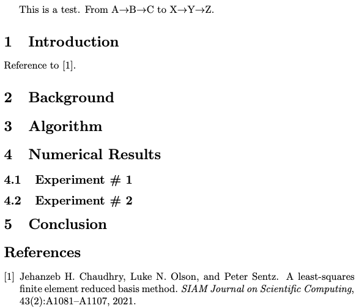

This guide shows you how to write a scientific article using the
[LaTeX](https://en.wikipedia.org/wiki/LaTeX) document preparation and markup
system. We emphasize typing commands at the [unix command
line](https://en.wikipedia.org/wiki/Unix_shell) in this guide as a way for
reader to see what is happening under the hood of the LaTeX engine and thus
gain flexibility and power over the production of their own academic documents.
We provide some links to graphical interfaces to LaTeX at the end of the
document.

To help people **practice** these commands we have a [Jupyter Lab](TODO)
instance available within which you can start a Terminal session so that you
can type the commands required to build a publication quality pdf from a LaTeX
file. You can start this environment [here](TODO).

To use LaTeX on your own computer, you will need to [install it](https://www.latex-project.org/get/).

# Structure and Markup

A LaTeX document (or a `.tex` file) is a [plain
text](https://en.wikipedia.org/wiki/Plain_text) document that contains commands
that tell a processing program how to create a beautiful pdf. These commands
can be "markup" like `\textbf{this is bold}` for **bold text** or `$\alpha +
\beta \frac{1}{x^2}$` for math like $\alpha + \beta \frac{1}{x^2}$ or commands
that tell LaTeX about document structure like `\section{Introduction}` or even
commands to print all of the bibliography like
`\bibliography{refs_example.bib}`.

Once you have a plain text document with markup, you then process it using a
set of programs to create a publishable output like a `.pdf` file.

This figure shows a whole LaTeX document and explains at a high level what
the parts of the document do..


After processing that document (via, say, the command `latexmk -pdflatex
example.tex`, assuming that the document is called `example.tex`), one can see
a pdf file like the following image:

{ style="width: 50%; margin: auto; text-align: center;" }

## Takeaways

- The LaTeX system separates the creation of beautiful documents from the act
   of efficiently and comfortably typing them.
- Typing a document using LaTeX commands involves plain text --- which means
   that you can type the commands in whatever way feels most efficient and
   comfortable for you.
- Processing a document once typed involves asking a computer to interpret the
   commands you entered and to produce some output that, ideally (1) will not
   change when different people view it (since you want control over how your
   paper looks) and (2) is beautiful.

## Practice

What does `example.tex` look like when compiled to a pdf document? Can you add
a title or author? Can you make some text bold?^[Try out `\title{Some Paper}`
and `\author{Some Person}` *in the preamble* and `\maketitle` just after the
`\begin{document}` line.] You can practice by looking at the directory
`1_structure` in the Jupyter Lab window that launches when you clink on `launch
binder` from the `README.md` file in the the [associated github
repository](https://github.com/bowers-illinois-edu/egap-latex-guide) and then
clicking on the `Terminal` icon in the Jupyter Lab pane. Once you are there,
try typing `latexmk -pdflatex example.tex` and then looking at the pdf.

You can also copy the github repository to your own local machine and launch
the Terminal to see a Unix command prompt if you are using a Mac or Linux
machine. Windows machine also offer a unix command prompt, but it is a [bit
more involved to install
it](https://docs.microsoft.com/en-us/windows/wsl/install-win10).


# Flavors and Programs: tex, latex,  pdflatex, etc

Although the most basic program that parses markup is called `latex`, in
current daily use, you will mostly find yourself using `pdflatex` or `xelatex`
or maybe `lualatex`.

When [Donald Knuth](https://en.wikipedia.org/wiki/Donald_Knuth) created this
approach to making beautiful scientific documents, he started with the `tex`
program but [Leslie Lamport](https://en.wikipedia.org/wiki/Leslie_Lamport)
built `latex` by combining multiple `tex` commands into fewer and simpler
macros. Both originally created documents in `dvi` or `postscript` format.
Nowadays, `pdf` files are the best way to make a document that looks the same
to all who want to view it on their screens or print it for themselves.

Here is a list of the common programs that one might use to create a pdf file from a latex document:

- `tex`: a program that typesets TeX directives or macros
- `pdftex`: a program that generates a PDF (instead of DVI)
- `latex`: a program that typesets a pile of LaTeX macros to make things
  easier
- `bibtex`: a program to take bibliographic information from a `.aux` file
  (created by a run of `latex` or `pdflatex` etc.) and generates a
  bibliography.
- `biber`: a program like bibtex but with more database management
  capabilities.
- `pdflatex`: a program that generates a PDF
- `xelatex`: support for a wide variety of fonts and characters (you can type
  `xelatex example.tex` after [changing the
  font](https://www.overleaf.com/learn/latex/XeLaTeX) to one that is installed
  on your system).
- `lualatex`: extends latex so that more programming can be done within it
  (via Lua for more complicate document designs and workflows. See [here for
  more on
  lualatex](https://www.overleaf.com/learn/latex/Articles/An_Introduction_to_LuaTeX_(Part_1):_What_is_it—and_what_makes_it_so_different%3F)).

For example, at the Unix command prompt in the Terminal, you might type
`pdflatex example.tex` create an `example.pdf` file (if you only do it once,
the citation will show up as a `?` and no bibliography will be printed).

Notice also:

- `pdflatex` (or `xelatex` or `lualatex`) takes several passes --- must be run
   more than one time --- if your document involves citations or other more
   complex features (like cross-references, tables of contents, etc.).
- Tools like `latexmk` or `latexrun` automate this process of multiple passes
   by a latex processing program and a bibliography creation program.

 The following figure shows how it may require three runs of `pdflatex` (plus a
 run of `bibtex`) to go from an `example.tex` file to an `example.pdf` file:

 

You can replace those multiple lines with a single call to `latexmk -pdflatex example.tex`.


## Takeaways

- always use LaTeX markup: very rarely (if ever) should you need to dip into
   plain TeX
- always use PDF output (pdflatex) and PDF figures (or PNG ... more on this
   later) rather than DVI or PS format for sharing documents


## Practice

See the directory `2_texflavors` and the `readme.md` file therein. Can you
change the font and use `xelatex` to make a pdf, say, trying `latexmk -xelatex
example.tex`?

# LaTeX workflows

A given scientific paper will require many files. For example, a research team
may split the document into multiple  `.tex` files (`intro.tex`, `results.tex`,
etc.) and then combine them for compilation into one big `main.tex`; many
papers involve multiple `.pdf` files for figures, `.tex` files for tables, and
at least one `.bib` file for bibliographies.

For example a `main.tex` file might look like this:

```{.latex}
\documentclass{article}
\title{My Title}
\begin{document}
\maketitle
\input{abstract}
\input{intro}
\input{results}
...
\bibliography{mybib.bib}
\end{document}
```

But `results.tex` might look like this:

```{#lst:figex .latex}
\section{Results}

Figure~\ref{fig:vaccine_by_pop} shows that opposition to vaccination peaks at a population of 100,000.

\begin{center}
\begin{figure}[!ht]
\includegraphics[width=.8\textwidth]{vaccine_by_pop.pdf}
\caption{Vaccination opposition by population}\label{fig:vaccine_by_pop}
\end{figure}
\end{center}

```

That number `100,000` and the figure `vaccine_by_pop.pdf` came from an R
command file called `vaccine_by_pop.R` which relied on data cleaned by
`vaccine_data_cleaning.py` plus other files which downloaded data from the web
and cleaned and merged the data together.

Collaborators require guides or maps to understand how files relate to each
other (see section 3 of @bowers2016future).

There are two main complementary approaches to managing this collaboration [@bowers2016future]:

- "File organization can be a map itself" .
- Provide an input-output map using files like a `Makefile`, `README.md`, `requirements.txt`

## Takeaways

We recommend that:

 1. you agree upon and commit to one approach for at least one project;
 2. that you follow the general advice from the [Zen of Python](https://www.python.org/dev/peps/pep-0020/#id2)

> Simple is better than complex.
Complex is better than complicated.
Flat is better than nested.

 3. that you separate:
  - Data collection or raw data  (e.g.  `data1.csv, …, datan.csv`)
  - Parsed or processed data (e.g.  `data_merged_filtered.db`)
  - Plotting data (e.g.  `temp_vs_time.csv`)
  - Plotting script (e.g.  `temp_vs_time.py`)

4. That each output like a table or figure uses one script with the same
   name:`temp_vs_time.pdf &lt;—&gt;  temp_vs_time.py` and that LaTeX labelling
   follow this convention `\label{fig:temp_vs_time}`


## On Directory Structure

Here are a few examples of directory structures have have worked for us:

In this example, the versions of the paper are kept in their own directories:

```{bash}
paper_topic_name_dir_name              | string used for repo, tex, and bib files
+ requirements.txt                   | number of pages,  etc
+ 1_submitted_paper
|   +-- paper_topic_name.tex
|   +-- refs_topic_name.bib
|   +-- journal_class.cls              | any files needed for the journal latex style
|   +-- figures
|   |   +-- temp_vs_time.pdf           | descriptive names for figures (not fig1.pdf, etc)
|   |   +-- error_vs_stepsize.pdf
|   |   `-- ...
|   +-- data                           | data files that generate the figures
|   |   +-- Makefile                   | Makefile that will re-generate all figures
|   |   +-- temp_vs_time.csv           | use the same name as the resulting figure
|   |   +-- plot_temp_vs_time.py       | plotting scripts, use names like plot_.py
|   |   `-- ...
|   `-- submitted_paper_topic_name.pdf | actual PDF file submitted
+ 2_reviews
|   +-- review_1.pdf                   | individual reviews
|   +-- review_2.pdf
|   `-- editor_statement.pdf           | instructions and summary from editor
+ 3_response_to_reviews
|   +-- response_topic_name.tex
|   `-- sent_response_topic_name.pdf   | actual PDF file sent to editor
` 4_revised_paper
    +-- paper_topic_name_revised.tex
    +-- refs_topic_name_revised.bib
    +-- journal_class.cls              | copy here any other files needed
    +-- figures                        | copy here all the figures again
    |   +-- temp_vs_time.pdf           | edit figures as needed
    |   +-- error_vs_stepsize.pdf
    |   `-- ...
    +-- data                           | copy all data again and edit as needed
    |   `-- ...
    `-- submitted_paper_topic_name_revised.pdf | actual PDF submitted

Reference: Matt West @ https://lagrange.mechse.illinois.edu/latex_quick_ref/
```

In this version, which Jake uses, there are different git branches for
different versions, and a single Makefile for all tasks (from turning the paper
into a pdf file via LaTeX, to creating figures, etc.)

```{bash}
paper_topic_name_dir_name              | string used for repo, tex, and bib files
+ Makefile                             | file that tracks file relationships
+-- Data                               | directory for data and data cleaning, merging work
    + README.md                        | file with instructions and explanations
    + merge_data.R                     |
    + orig_data.csv                    | original data set, not to be changed
    + merge_data.csv                   |
    `-- ...                            |
+-- Analysis                           |
    + README.md                        |
    + linear_simulations.R             | file that runs simulations and saves output
    + linear_simulations.rda           | output from linear_simulations.R
    `-- ...                            |
+-- Figures                            |
    + README.md                        |
    + linear_simulations_N100.R        | file creating a figure
    + linear_simulations_N100.pdf      | the figure from linear_simulations_N100.R
    + descriptives.R                   | file creating a table
    + descriptives.tex                 | the table in LaTeX format
    `-- ...                            |
+-- Paper                              |
    + README.md                        |
    + main.tex                         | the main LaTeX file
    + abstract.tex                     | the abstract file
    `-- ...                            |
+-- References                         |
    + big.bib                          | bibliography file
    `-- ...                            |
```

See also the discussion in @bowers2016future, section 3.

## Practice

See the directory `3_workflows` and the `readme.md` file therein.

# On collaboration

Here we discuss our process for writing papers with others (and ourselves as we
revise papers, return to old papers, respond to re-analyses, etc.. in the future)

## Collaborating asychronously: git version control

We use [git version control via the github
interface](https://github.com/git-guides) as a part of our collaboration (with
others, or versions of ourselves responding to reviewers, making revisions, etc.)

We do not describe it in-depth here. Given some knowledge about git, we advise
the following practices:

What to track:

- Your `.tex file`
- The `.bib` file (either a global one used across your projects or one created for your specific project)
- Figures -&gt;  `./figures/*.pdf`
- Scripts for the figures -&gt; `./data/*.py` , `./data/*.R`
- Data for the figures -&gt; ` ./data/*.csv`

What not to track:

- Any data with personally identifying information or information that cannot ethically be made public.
- The pdf of the paper -&gt;  `paper_randnoise.pdf`
- Any typesetting output -&gt; ` *.log`, `*.bbl`, `*.aux`, etc

Tips for using git to track versions and changes among co-authors in writing a LaTeX paper:

- Agree with your co-authors about how you will organize the text in your documents. We have used on one of
   - one sentence per line
   - hard wrapping at say 80 characters
   - nothing, free for all (plus or minus pre-commit automatic reformatting or checking of files).
- Commit *often*
- For large edits, take sections at a time, to reduce merge conflicts
- Before you commit and push the repository for collaborators you need to do a
   clean recompile at the command line.


## Collaborating synchronously

Fewer tools allow collaborators to edit plain text documents at the same time.
We nearly always rely on asychronous collaboration, even if we have broken up a
task and the whole team is working on it at the same time, even in the same room.

[Overleaf](https://www.overleaf.com) is designed for this task. It compiles
LaTeX and syncs with github. See also the online versions of LaTeX listed [here](https://www.latex-project.org/get/).

There are other systems for editing plain text at the same time such as [Teletype for Atom](https://teletype.atom.io).

## Takeaways

- Writing a scientific paper is an act of collaboration --- with a team at the
   same time, with yourself in the future, perhaps with those who will download
   your data and code and try to learn from it after it is published. So, you
   have to think about and talk about collaboration when you set out to write a
   paper.
- Use the git system for version control whether or not you also work
   synchronously.
- TODO

## Practice

See the directory `4_git` and the `readme.md` file therein.

# On Writing: An interlude…

You already know Hemingway's famous quote: "the only kind of writing is
re-writing". However, you might not know about linters.

## On Linters

A linter is a program that analyzes the text that you write as you write it.
When your mis-spelled words are highlighted in your email client, you are
seeing the results of a linter alerting you to improve your text. Linters are
also used in programming --- catching code errors before you need to run the
code, for example, by alerting you to unmatched parentheses or missing
semi-colons or the like.

Other linters can look for **style problems**. Consider the following terrible sentence:

> More research is needed to fill the gap created in extant literature in order to impact policy with very important findings.

One of our linters, the [write-good](https://github.com/btford/write-good) linter, alerted us to some problems:

```
col 16 error| [write-good] "is needed" may be passive voice [E]
col 71 error| [write-good] "in order to" is wordy or unneeded [E]
col 102 error| [write-good] "very" is a weasel word and can weaken meaning [E]
```

Of course, linters cannot do it all. We like them because they draw attention
to sentences which may need work. We bet that most readers of this guide would
be able to re-write that sentence without using the passive voice, without
using "impact" as a verb (yuck!), and with a stronger justification for
research than to just fill a gap in the literature.

## Tips and Tricks

Some tips that work for us:

- Read paragraphs and sentences out loud to "edit by ear" @howardsbecker1986a.
- Step away from your writing for a day or more in order to come back to it
  with fresh eyes.
- We recommend the following two guides to academic writing: @gopen1990science and @howardsbecker1986a.
- We routinely use [alex](https://alexjs.com),
  [proselint](http://proselint.com), and
  [write-good](https://github.com/btford/write-good) for our writing. The [LanguageTool](https://languagetool.org) also looks promising.
- Avoid constantly re-compiling your document to see how it looks unless you
  are working on difficult diagrams and mathematics. Your first task is writing
  not reading.
- Mark open items and second pass items with  `%TODO`. You can find all places
  where you have `%TODO` in your document using: `grep TODO
  paper_randnoise.tex`
- Clear contributions, Outline, Write/Revise
- Polish and make it look visually appealing to read at the end.

## Takeaways

-  Peer reviewed publications are critically important to science —-- treat your writing and presentation of results with care
-  Peer reviewed publications take reviewer/editor time -— treat your writing and presentation of results with care
-  (Hopefully) Many people will read your publication -— treat your publication with care

## Practice

See the directory `6_linting` and the `readme.md` file therein.

# LaTeX dos and don'ts

Here are some facts about how to use LaTeX. Obviously not just opinions. :)
(LUKE: Maybe you can add some examples etc. here?)

DO keep your LaTeX readable!

- Block indent equations
- Align tabular data
- Limit whitespace

DON'T overuse macros

- Intended for complex arrangements with repeated use
- Things that might change.

DO use packages for consistent layouts

- booktabs: provides clean horizontal lines for tables (avoid vertical lines).
- siunitx: to format large numbers and notation

DON'T use `\begin{align}` for everything, instead try specific environments built for your purpose.

- equation: base
- align: multiple equations
- split: one equation split with alignment
- multline: one equation split with no alignment

DO use consistent fonts throughout (including within figures).

- Label figures with \label{fig:easy_figure_name}
- Label equations with \label{eq:useful_equation_name}
- Label sections with \label{sec:i_can_remember_this_section_name}
- Label tables with \label{tab:what_a_great_table_name}

## Takeaways

TODO

## Practice

See the directory `7_dos` and the `readme.md` file therein.

# On citations and bibliographies

The LaTeX system allows you to (1) insert citations in your text using commands
like `\cite{ChOlSe_2021_lsrbm}` which can turn into `[7]`, `(Chaudhry et al.,
2021)`,  `[Ch21]` or other citation styles within the text itself and also (2)
to print out your bibliography, formatted according to your journal's
guidelines, using a single command in the LaTeX document like
`\bibliography{mybib.bib}`. Separating formatting from information saves time:
hundreds of citations will be printed automatically in the correct format if
desired including only the sources you cited. If you decide that you no longer
need a citation, this will be automatically removed from your bibliography.
Journals often provide formatting guidelines in `.bst` files that can be
referred to in the `\bibliographystyle{}` command.

The program `bibtex` (or `biber`) reads `.aux` files created by latex programs
and creates a `.bbl` file which is then read by the latex program to format
everything (above we showed the need to run latex, bibtex, latex, and latex in
order for example, in order to make this work).

In order to use this system, you need a plain text file that is a database with
entries formatted in BibTeX format. For example, here is one entry in the
BibTeX file for this essay:

```{.bibtex}
@article{ChOlSe_2021_lsrbm,
	author = {Chaudhry, Jehanzeb H. and Olson, Luke N. and Sentz, Peter},
	doi = {10.1137/20M1323552},
	journal = {SIAM Journal on Scientific Computing},
	number = {2},
	pages = {A1081-A1107},
	title = {A Least-Squares Finite Element Reduced Basis Method},
	url = {https://doi.org/10.1137/20M1323552},
	volume = {43},
	year = {2021}}
```

## General workflow

- Grab full citation online at citation’s journal and/or Google Scholar [see
  instructions here for getting BibTeX formatted entries from Google
  Scholar](https://texblog.org/2014/04/22/using-google-scholar-to-download-bibtex-citations/)
- Clean up entry (removing abstracts or other fields)
- Format cleanly.  Use `{ }` instead of `“ “`
- `{ }` also force capitalization: `title = {All about {Krylov} methods}`


## Takeaways

- You will only need to add a BibTeX entry to your bibliography database (your `.bib` file) once. (And you can use tools like [Zotero](https://guides.library.iit.edu/c.php?g=720120&p=6296986) and [BibDesk](https://bibdesk.sourceforge.io) to make managing those collections of bibliographic information easier.)

## Practice

See the directory `8_citations` and the `readme.md` file therein.

# On Figures and Tables and Math

Figures, tables, and math break up the text of a document and convey
information that can make or break your attempts to persuade with your paper.
We have a few suggestions about how to make these elements work with instead of
against you here.

In general, if a figure or table has been created using code, your project
should have a figure or table creation file like `linear_simulations_N100.R` which
creates one figure in pdf format `linear_simulations_N100.pdf`. This figure
creation file might require as input another file with simulation results, and
in turn the simulation results creator file may need some data: we might notate
this dependence among files like in our `Makefile`. For example in line 1
`Data/clean_data.csv: Data/clean_data.R Data/raw_data.csv` means that the file
`Data/clean_data.csv` depends on `Data/clean_data.R Data/raw_data.csv` (is
created by the `.R` file and the `.csv` file together). And line 2 is a command
used to create `Data/clean_data.csv` (in this case, the command is `R ---file
Data/clean_data.R`.


```{.makefile .numberLines}
Data/clean_data.csv: Data/clean_data.R Data/raw_data.csv
    R ---file Data/clean_data.R

Analysis/linear_simulations.rda: Analysis/linear_simulations.R Data/clean_data.csv
    R --file Analysis/linear_simulations.R

Figures/linear_simulations_N100.pdf: Figures/linear_simulations_N100.R Analysis/linear_simulations.rda
    R --file Figures/linear_simulations_N100.R
```

In general Figures, Tables, and Math should appear close to where they are
discussed in the text. Do not put them at the end of your document if you don't
want a grumpy reader: recall that most people are reading pdf documents on screens.

## Figures

- Tell LaTeX where to look for graphics using the `\graphicspath{}` command in
the preamble.  For example, we use `\graphicspath{{.}{../Figures/}}`.

- We insert graphics into documents using the `\includegraphics[]{}` command. For
example, if we wanted to include a figure but scale it to 1/3 of the width of
the text (the area within the left and right margins), we would use:
`\includegraphics[width=0.3\textwidth]{myfig.pdf}`{.latex}.

- Fonts in figures should match the fonts in the float/article. Note that using `\includegraphics` to scale a figure will also change the font sizes --- be careful to ensure your figure text is easy to read.
  - Options for font matching in pdf figures using R: <https://cran.r-project.org/web/packages/tikzDevice>, <https://cran.r-project.org/web/packages/extrafont>

- You should attach a float environment after the paragraph of first reference. For example:

```{.latex}
Figure~\ref{fig:vaccine_by_pop} shows that opposition to vaccination peaks at a population of 100,000.

\begin{center}
\begin{figure}[!ht]
\includegraphics[width=.8\textwidth]{vaccine_by_pop.pdf}
\caption{Vaccination opposition by population}\label{fig:vaccine_by_pop}
\end{figure}
\end{center}
```

- Generally use `\begin{figure}[!ht]` or `\begin{table}[!ht]`
- `!` tex will ignore area restrictions
- `h` place it “here” if it fits in the area
- `t` place it at the “top” otherwise and if it fits otherwise create a new page

- Don't use `\FloatBarrier` and other tricks like `\newpage`, `\vspace` or `\hspace` for spacing

- Use consistent color schemes in all figures throughout the paper.

- Label everything. (TODO expand)

- Do not introduce new notation in a figure or its caption. A reader should not have to hunt in the text to understand a figure.

- The figure caption should describe, not discuss. A reader should not have to
  hunt in the text to understand a figure.


## Tables

- If a table contains elements (like numbers) generated from code, then it
  should be generated entirely from code and saved in its own file.  
  - In R, for example, we might use the `xtable` package to convert a matrix or
    data-frame to a LaTeX formatted table.

- Tables should rarely have vertical lines, and in fact, tables should use as
  few lines as possible. (See [this nice short guide on
  tables](https://people.inf.ethz.ch/markusp/teaching/guides/guide-tables.pdf)).

The figure caption should describe, not discuss. A reader should not have to hunt in the text to understand a figure.

## Math

Math fonts should work with the main font of the article. For examples of good
math and text font pairings see the [LaTeX Font
Catalogue](https://tug.org/FontCatalogue/mathfonts.html).

## Takeaways

TODO

## Practice

See the directory `9_figures` and the `readme.md` file therein.

## Ways to type a document using LaTeX markup

A LaTeX document is a plain text file. This means that you can use any text
editor to write a LaTeX document. However, a text editor that (1) recognizes
that `\textbf{}` is a LaTeX command or that (2) keeps track of matching braces
and parentheses makes it easier to write LaTeX markup. To that end, we use
[neovim](http://neovim.io) (sometimes with the [vimr
gui](https://github.com/qvacua/vimr)) with
[vimtex](https://github.com/lervag/vimtex) plugins but we know that there are
many other approaches to typing a plain text document using LaTeX markup.

Our friends who use LaTeX like the following systems. Each person prefers to interact with their computer differently, so we merely list what we've heard about here.

- [Emacs with Auctex](https://kevinlanguasco.wordpress.com/2019/04/29/latex-editing-with-emacs-on-manjaro/)
- [Neovim or Vim with vimtex or texlab]
- [TexPad]() (we think this hides too many errors and warnings, so we think this is most useful so that you can go back to the command line)
- [TexShop]() (we think this hides too many errors and warnings, so we think this is most useful so that you can go back to the command line)
- [TeXstudio]
- [Atom]
- [Sublime 3]

# Journal Style (TEMPTED TO DROP THIS)

The journal will have a style file. For example, see:  <https://www.siam.org/publications/journals/about-siam-journals/information-for-authors#dnn_ctr2112_ContentPane>


- The journal will also have a style *guide*. For example, see:  <https://www.siam.org/Portals/0/Publications/Journals/stylemanual/SIAM_STYLE_GUIDE_2019.pdf>

Following both of these will speed up the review and copy editing.

## Practice

See the directory `5_style` and the `readme.md` file therein.

# Extra:

## Helpful tools

- tikz: sharp figures and schematics in LaTeX
- tikzpdf: build/rebuild tikzpictures
   - <https://github.com/lukeolson/tikzpdf>
- latexrun: compile and summarize warnings
- chktex: a LaTeX linter
- betterbib: automatically format/update your bib entries
   - <https://github.com/nschloe/betterbib>
- illinois-letterhead: a letterhead in LaTeX
   - <https://github.com/lukeolson/illinois-letterhead>
- scrub your LaTeX and submit to Arxiv:
   - <https://github.com/lukeolson/clean-latex-to-arxiv.git>
- booktabs: nice looking tables
- siunitx: nice looking numbers and units
- algorithm2e: algorithm environment
- cleveref: `\cref{}` referencing for all
- hyperref: hyper linkes to figures, etc
- backref: add page numbers to the bib
- microtype: [[http://www.khirevich.com/latex/microtype/]{.ul}](http://www.khirevich.com/latex/microtype/)
- enumitem: full control of itemize environments

## Information about this document

We wrote this document using [pandoc flavored markdown]() and turned it from plain text into HTML via the following command at the unix command line on our OS X laptops:

```
pandoc latex-guide.md --to html4 --from markdown+yaml_metadata_block+autolink_bare_uris+tex_math_single_backslash+inline_code_attributes --output latex-guide.html  --self-contained --variable bs3=TRUE --standalone --section-divs --template latex-guide-template.html   --include-in-header latex-guide-header.html --number-sections --table-of-contents --toc-depth=1  --variable theme=bootstrap --mathjax --variable 'mathjax-url:https://mathjax.rstudio.com/latest/MathJax.js?config=TeX-AMS-MML_HTMLorMML' --citeproc
```

Alternatively, if you have access to R, you can do the following to turn this markdown document into HTML.

```r
Rscript -e "library(rmarkdown); render('latex-guide.md')"
```

# References
