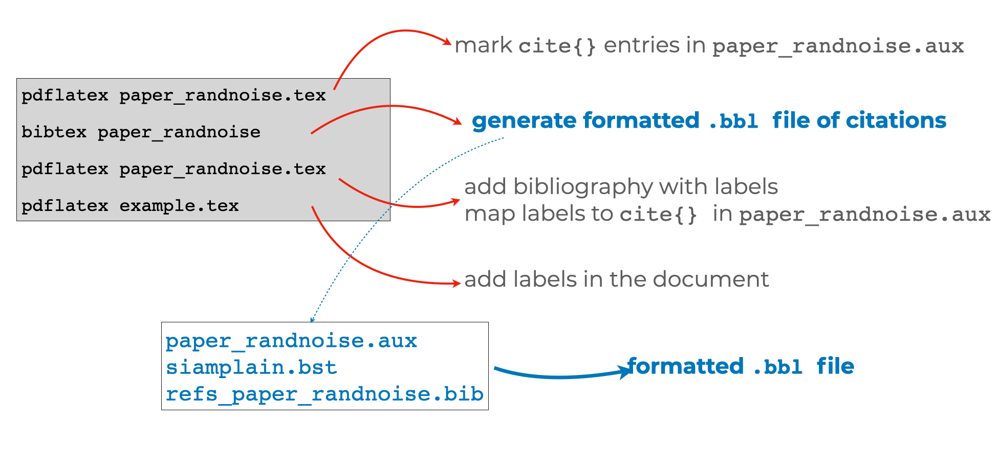

This guide shows you how to write a scientific article using the
[LaTeX](https://en.wikipedia.org/wiki/LaTeX) document preparation and markup
system. We emphasize typing commands at the [unix command
line](https://en.wikipedia.org/wiki/Unix_shell) in this guide as a way for
reader to see what is happening under the hood of the LaTeX engine and thus
gain flexibility and power over the production of their own academic documents.
We provide some links to graphical interfaces to LaTeX at the end of the
document.

To help people **practice** these commands we have a [Jupyter Lab](TODO)
instance available within which you can start a Terminal session so that you
can type the commands required to build a publication quality pdf from a LaTeX
file. You can start this environment [here](TODO). 

# Structure and Markup

A LaTeX document (or a `.tex` file) is a [plain
text](https://en.wikipedia.org/wiki/Plain_text) document that contains commands
that tell a processing program how to create a beautiful pdf. These commands
can be "markup" like `\textbf{this is bold}` for **bold text** or `$\alpha +
\beta \frac{1}{x^2}$` for math like $\alpha + \beta \frac{1}{x^2}$ or commands
that tell LaTeX about document structure like `\section{Introduction}` or even
commands to print all of the bibliography like
`\bibliography{refs_example.bib}`. 

Once you have a plain text document with markup, you then process it using a
set of programs to create a publishable output like a `.pdf` file.

This figure shows a whole LaTeX document and explains at a high level what
the parts of the document do..


After processing that document (via, say, the command `latexmk -pdflatex
example.tex`, assuming that the document is called `example.tex`), one can see
a pdf file like the following image:

{ style="width: 50%; margin: auto; text-align: center;" }

## Takeaways

 - The LaTeX system separates the creation of beautiful documents from the act
   of efficiently and comfortably typing them.
 - Typing a document using LaTeX commands involves plain text --- which means
   that you can type the commands in whatever way feels most efficient and
   comfortable for you.
 - Processing a document once typed involves asking a computer to interpret the
   commands you entered and to produce some output that, ideally (1) will not
   change when different people view it (since you want control over how your
   paper looks) and (2) is beautiful. 

## Practice:

What does `example.tex` look like when compiled to a pdf document? Can you add
a title or author? Can you make some text bold?^[Try out `\title{Some Paper}`
and `\author{Some Person}` *in the preamble* and `\maketitle` just after the
`\begin{document}` line.] You can practice by looking at the directory
`1_structure` in the Jupyter Lab window that launches when you clink on `launch
binder` from the `README.md` file in the the [associated github
repository](https://github.com/bowers-illinois-edu/egap-latex-guide) and then
clicking on the `Terminal` icon in the Jupyter Lab pane. Once you are there,
try typing `latexmk -pdflatex example.tex` and then looking at the pdf. 

You can also copy the github repository to your own local machine and launch
the Terminal to see a Unix command prompt if you are using a Mac or Linux
machine. Windows machine also offer a unix command prompt, but it is a [bit
more involved to install
it](https://docs.microsoft.com/en-us/windows/wsl/install-win10).


# Flavors and Programs: tex, latex,  pdflatex, etc ...

Although the most basic program that parses markup is called `latex`, in
current daily use, you will mostly find yourself using `pdflatex` or `xelatex`
or maybe `lualatex`. 

When [Donald Knuth](https://en.wikipedia.org/wiki/Donald_Knuth) created this
approach to making beautiful scientific documents, he started with the `tex`
program but [Leslie Lamport](https://en.wikipedia.org/wiki/Leslie_Lamport)
built `latex` by combining multiple `tex` commands into fewer and simpler
macros. Both originally created documents in `dvi` or `postscript` format.
Nowadays, `pdf` files are the best way to make a document that looks the same
to all who want to view it on their screens or print it for themselves.

Here is a list of the common programs that one might use to create a pdf file from a latex document:

 - `tex`: a program that typesets TeX directives or macros
 - `pdftex`: a program that generates a PDF (instead of DVI)
 - `latex`: a program that typesets a pile of LaTeX macros to make things
   easier
 - `bibtex`: a program to take bibliographic information from a `.aux` file
   (created by a run of `latex` or `pdflatex` etc.) and generates a
   bibliography.
 - `biber`: a program like bibtex but with more database management
   capabilities.
 - `pdflatex`: a program that generates a PDF
 - `xelatex`: support for a wide variety of fonts and characters (you can type
   `xelatex example.tex` after [changing the
   font](https://www.overleaf.com/learn/latex/XeLaTeX) to one that is installed
   on your system).
 - `lualatex`: extends latex so that more programming can be done within it
   (via Lua for more complicate document designs and workflows. See [here for
   more on
   lualatex](https://www.overleaf.com/learn/latex/Articles/An_Introduction_to_LuaTeX_(Part_1):_What_is_it—and_what_makes_it_so_different%3F)).

For example, at the Unix command prompt in the Terminal, you might type
`pdflatex example.tex` create an `example.pdf` file (if you only do it once,
the citation will show up as a `?` and no bibliography will be printed).

Notice also:

 - `pdflatex` (or `xelatex` or `lualatex`) takes several passes --- must be run
   more than one time --- if your document involves citations or other more
   complex features (like cross-references, tables of contents, etc.).
 - Tools like `latexmk` or `latexrun` automate this process of multiple passes
   by a latex processing program and a bibliography creation program.

 The following figure shows how it may require three runs of `pdflatex` (plus a
 run of `bibtex`) to go from an `example.tex` file to an `example.pdf` file:

 

You can replace those multiple lines with a single call to `latexmk -pdflatex example.tex`.


## Take-aways:

 - always use LaTeX markup: very rarely (if ever) should you need to dip into
   plain TeX
 - always use PDF output (pdflatex) and PDF figures (or PNG ... more on this
   later) rather than DVI or PS format for sharing documents


## Practice

See the directory `2_texflavors` and the `readme.md` file therein. Can you
change the font and use `xelatex` to make a pdf, say, trying `latexmk -xelatex
example.tex`?

# LaTeX workflows

A given scientific paper will require many files. For example, a research team
may split the document into multiple  `.tex` files (`intro.tex`, `results.tex`,
etc.) and then combine them for compilation into one big `main.tex`; many
papers involve multiple `.pdf` files for figures, `.tex` files for tables, and
at least one `.bib` file for bibliographies.

For example a `main.tex` file might look like this:

```{latex}
\documentclass{article}
\title{My Title}
\begin{document}
\maketitle
\input{abstract}
\input{intro}
\input{results}
...
\bibliography{mybib.bib}
\end{document}
```

But `results.tex` might look like this:

```{latex}
\section{Results}

Figure~\ref{fig:vaccine_by_pop} shows that opposition to vaccination peaks at a population of 100,000.

\begin{center}
\begin{figure}[!htb]
\includegraphics[width=.8\textwidth]{vaccine_by_pop.pdf}
\caption{Vaccination opposition by population}\label{fig:vaccine_by_pop}
\end{figure}
\end{center}

```

That number `100,000` and the figure `vaccine_by_pop.pdf` came from an R
command file called `vaccine_by_pop.R` which relied on data cleaned by
`vaccine_data_cleaning.py` plus other files which downloaded data from the web
and cleaned and merged the data together.

**With so many files, collaborators require guides or maps to understand how files relate to
each other.**  This is true even if you are mostly going to collaborate with yourself in the future @bowers2016future.


There are two main complementary approaches to managing this collaboration [@bowers2016future]:
 -  "File organization can be a map itself" .
 -  Provide an input-output map using files like a `Makefile`, `README.md`, `requirements.txt`

## Takeaways

We recommend that:

 1. you agree upon and commit to one approach for at least one project;
 2. that you follow the general advice from the [Zen of Python](https://www.python.org/dev/peps/pep-0020/#id2)

> Simple is better than complex.   
Complex is better than complicated.   
Flat is better than nested.   

 3. that you separate:
  - Data collection or raw data  (e.g.  `data1.csv, …, datan.csv`)
  - Parsed or processed data (e.g.  `data_merged_filtered.db`)
  - Plotting data (e.g.  `temp_vs_time.csv`)
  - Plotting script (e.g.  `temp_vs_time.py`)

4. That each output like a table or figure uses one script with the same
   name:`temp_vs_time.pdf &lt;—&gt;  temp_vs_time.py` and that LaTeX labelling
   follow this convention `\label{fig:temp_vs_time}`


## On Directory Structure

Here are a few examples of directory structures have have worked for us:

In this example, the versions of the paper are kept in their own directories:

```{bash}
paper_topic_name_dir_name              | string used for repo, tex, and bib files
+ requirements.txt                   | number of pages,  etc
+ 1_submitted_paper
|   +-- paper_topic_name.tex
|   +-- refs_topic_name.bib
|   +-- journal_class.cls              | any files needed for the journal latex style
|   +-- figures
|   |   +-- temp_vs_time.pdf           | descriptive names for figures (not fig1.pdf, etc)
|   |   +-- error_vs_stepsize.pdf
|   |   `-- ...
|   +-- data                           | data files that generate the figures
|   |   +-- Makefile                   | Makefile that will re-generate all figures
|   |   +-- temp_vs_time.csv           | use the same name as the resulting figure
|   |   +-- plot_temp_vs_time.py       | plotting scripts, use names like plot_.py
|   |   `-- ...
|   `-- submitted_paper_topic_name.pdf | actual PDF file submitted
+ 2_reviews
|   +-- review_1.pdf                   | individual reviews
|   +-- review_2.pdf
|   `-- editor_statement.pdf           | instructions and summary from editor
+ 3_response_to_reviews
|   +-- response_topic_name.tex
|   `-- sent_response_topic_name.pdf   | actual PDF file sent to editor
` 4_revised_paper
    +-- paper_topic_name_revised.tex
    +-- refs_topic_name_revised.bib
    +-- journal_class.cls              | copy here any other files needed
    +-- figures                        | copy here all the figures again
    |   +-- temp_vs_time.pdf           | edit figures as needed
    |   +-- error_vs_stepsize.pdf
    |   `-- ...
    +-- data                           | copy all data again and edit as needed
    |   `-- ...
    `-- submitted_paper_topic_name_revised.pdf | actual PDF submitted

Reference: Matt West @ https://lagrange.mechse.illinois.edu/latex_quick_ref/
```

In this version, which Jake uses, there are different git branches for
different versions, and a single Makefile for all tasks (from turning the paper
into a pdf file via LaTeX, to creating figures, etc.)

```
paper_topic_name_dir_name              | string used for repo, tex, and bib files           
+ Makefile                             | file that tracks file relationships                
+-- Data                               | directory for data and data cleaning, merging work
    + README.md                        | file with instructions and explanations
    + merge_data.R                     | 
    + orig_data.csv                    | original data set, not to be changed
    + merge_data.csv                   | 
    `-- ...                            | 
+-- Analysis                           | 
    + README.md                        | 
    + linear_simulations.R             | file that runs simulations and saves output  
    + linear_simulations.rda           | output from linear_simulations.R
    `-- ...                            | 
+-- Figures                            | 
    + README.md                        | 
    + linear_simulations_N100.R        | file creating a figure 
    + linear_simulations_N100.pdf      | the figure from linear_simulations_N100.R 
    + descriptives.R                   | file creating a table 
    + descriptives.tex                 | the table in LaTeX format 
    `-- ...                            | 
+-- Paper                              | 
    + README.md                        | 
    + main.tex                         | the main LaTeX file
    + abstract.tex                     | the abstract file 
    `-- ...                            | 
+-- References                         |  
    + big.bib                          | bibliography file
    `-- ...                            | 
```

See also the discussion in @bowers2016future, section 3.

## Practice

See the directory `3_workflows` and the `readme.md` file therein.

# git version control: Use it!

What to track:

- Your .tex file :)
- The .bib file
- Figures -&gt;  ./figures/*.pdf
- Scripts for the figures -&gt; ./data/*.py , ./data/*.R
- Data for the figures -&gt;  ./data/*.csv

What not to track:

- The pdf of the paper -&gt;  paper_randnoise.pdf
- Any typesetting output -&gt;  *.log, *.bbl, *.aux, etc

Tips:

 - Agree with your co-authors on one of 
   - one sentence per line
   - hard wrapping at say 80 characters
   - nothing, free for all

Commit *often*

For large edits, take sections at a time, to reduce merge conflicts

## Practice

See the directory `4_git` and the `readme.md` file therein.

# Journal Style

The journal will have a style file

Example:  <https://www.siam.org/publications/journals/about-siam-journals/information-for-authors#dnn_ctr2112_ContentPane>

- The journal will also have a style *guide*

Example:  <https://www.siam.org/Portals/0/Publications/Journals/stylemanual/SIAM_STYLE_GUIDE_2019.pdf> 

Following both of these will speed up the review and copy editing.

## Practice

See the directory `5_style` and the `readme.md` file therein.

# On Writing: An interlude…

- Use linters (what?)

- Mark open items and second pass items with  `%TODO`. You can find all places where you have `%TODO` in your document using:

```
grep TODO paper_randnoise.tex
```

- Clear contributions, Outline, Write/Revise

- Polish and make it look visually appealing to read

Remember: Peer reviewed publications are critically important to science — treat your writing and presentation of results with care

Remember: Peer reviewed publications take reviewer/editor time — treat your writing and presentation of results with care

Remember: (Hopefully) Many people will read your publication — treat your publication with care

## Practice

See the directory `6_linting` and the `readme.md` file therein.

# LaTeX dos and don’ts: Fact, not opinion! :)


DO keep your LaTeX readable!

  - Block indent equations
  - Align tabular data
  - Limited whitespace

DON'T overuse macros

  - Intended for complex arrangements with repeated use
  - Things that might change.

DO attach a float environment after the paragraph of first reference

  - Generally use `\begin{figure}[!ht]` or `\begin{table}[!ht]`
  - `!` tex will ignore area restrictions
  - `h` place it “here” if it fits in the area
  - `t` place it at the “top” otherwise and if it fits otherwise create a new page

DON'T use `\FloatBarrier` and other tricks like `\newpage`, `\vspace` or `\hspace` for spacing

DO use packages for consistent layouts

  - booktabs: clean tabular
  - siunitx: large numbers and notation

DON'T use align for everything

  - equation: base
  - align: multiple equations
  - split: one equation split with alignment
  - multline: one equation split with no alignment

DO use consistent fonts throughout (more on this…)

  - Label figures with \label{fig:*}
  - Label equations with \label{eq:*}
  - Label sections with \label{sec:*}
  - Label tables with \label{tb:*}

## Practice

See the directory `7_dos` and the `readme.md` file therein.

# On bibtex

- Bibtex: a program and a format for specifying bibliography entries
- Journals specify the formatting rules
- Several types
  - By id: [7]
  - By name [Olson 2021] or [Ol21]
  - Can be unsorted or listed by order of reference in the paper

The journal `.bst` defines the required fields

General workflow:

 - Grab full citation online at citation’s journal
 - Clean up entry (removing abstracts or other fields)
 - Format cleanly.  Use `{ }` vs `“ “`
 - `{ }` also force capitalization:
 - `title = {All about {Krylov} methods}`




## Practice

See the directory `8_citations` and the `readme.md` file therein.

# On Figures

Fonts in figures should match the fonts in the float/article.

`\includegraphics[width=0.3textwidth]{./figures/myfig.pdf}` also scales the fonts -- be careful to ensure your figure text is easy to read.

Use consistent color schemes throughout the paper

Label everything

Do not introduce new notation in a figure or its caption

The figure caption should describe, not discuss.


## Practice

See the directory `9_figures` and the `readme.md` file therein.

# Helpful tools


tikz: sharp figures and schematics in LaTeX

tikzpdf: build/rebuild tikzpictures

 - <https://github.com/lukeolson/tikzpdf>

latexrun: compile and summarize warnings

chktex: a LaTeX linter

betterbib: automatically format/update your bib entries

 - <https://github.com/nschloe/betterbib>

illinois-letterhead: a letterhead in LaTeX

 - <https://github.com/lukeolson/illinois-letterhead>

scrub your LaTeX and submit to Arxiv:

 - <https://github.com/lukeolson/clean-latex-to-arxiv.git>

booktabs: nice looking tables

siunitx: nice looking numbers and units

algorithm2e: algorithm environment

cleveref: `\cref{}` referencing for all

hyperref: hyper linkes to figures, etc

backref: add page numbers to the bib

microtype: [[http://www.khirevich.com/latex/microtype/]{.ul}](http://www.khirevich.com/latex/microtype/)

enumitem: full control of itemize environments

# Collaborate Asynchronously using Github

See

On commit messages

# Collaborate Synchronously using...

There are several tools that allow collaborators to edit plain text documents at the same time.

Some like [Overleaf]() because it compiles LaTeX.

Others like [Teletype for Atom](https://teletype.atom.io).

Or [Hedgedoc]()

Or [Hack MD]()

Or [TeXPad Connect]()

# Extra:

Before you commit and send it to collaborators you need to do a clean recompile at the command line.

## Ways to type a document using LaTeX markup

A LaTeX document is a plain text file. This means that you can use any text editor to write a LaTeX document. However, a text editor that (1) recognizes that `\textbf{}` is a LaTeX command or that (2) keeps track of matching braces and parentheses makes it easier to write LaTeX markup. To that end, we use [neovim]() with [vimtex]() plugins but we know that there are many other approaches to typing a plain text document using LaTeX markup.

Our friends who use LaTeX like the following systems. Each person prefers to interact with their computer differently, so we merely list what we've heard about here.

 -  [Emacs with Auctex](https://kevinlanguasco.wordpress.com/2019/04/29/latex-editing-with-emacs-on-manjaro/)
 -  [Neovim or Vim with vimtex or texlab]
 -  [TexPad]() (we think this hides too many errors and warnings, so we think this is most useful so that you can go back to the command line)
 -  [TexShop]() (we think this hides too many errors and warnings, so we think this is most useful so that you can go back to the command line)
 -  [TeXstudio]
 -  [Atom]
 -  [Sublime 3]

## Information about this document

We wrote this document using [pandoc flavored markdown]() and turned it from plain text into HTML via the following command at the unix command line on our OS X laptops:

```
pandoc --css latex-guide.css --standalone -N  --from=markdown+yaml_metadata_block -V date="Version of $(date +%Y-%b-%d%n)" latex-guide.md -o latex-guide.html

```


# References
